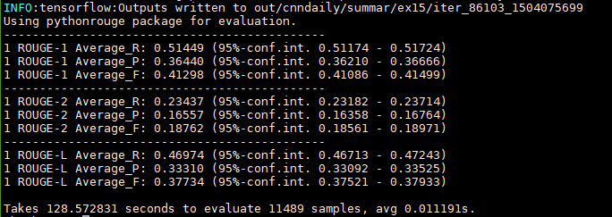

# Research plan for enhance-coherence

[TOC]

## Plan for article writing

1. Write the related work part (July 8)
2. Write the introduction part (July 9)
3. Write the model part (before July 10)

## Plan for implementation

1. Prepare CNN/Dailymail dataset
2. Implement data reader for the dataset
3. Adopt the SummaRuNNer model and train on this dataset
4. Adopt the coherence scorer to this part
5. Human evaluation

## Micro plans

### 8/19 (Sat.)

1. Check whether test/validation sets are majorly different from training set.
   1. Manually compare: (1) there are some ads in test set, but not a major cause (2) training set: 201106-201508; validation set: 201503-201508; test set: 201504-201508. There are only 50k samples (25%) in training set that is after 201504.
   2. Compare ROUGE scores on training/validation/test set: (1) training set (2) validation set (3) test set
   3. Merge CNN/Daily Mail and train again.
2. Utilize the html tag information for sentence tokenizing.
3. Implement the scorer module.
4. Review my code.

Daily Mail

* iter48507 on 10k sampled training set: 'ROUGE-L-F': 0.32866, 'ROUGE-2-F': 0.16251, 'ROUGE-1-F': 0.36224
* iter30767 on test set: 'ROUGE-L-F': 0.34757, 'ROUGE-2-F': 0.17302, 'ROUGE-1-F': 0.38278
* iter48507 on test set: 'ROUGE-L-F': 0.34731, 'ROUGE-2-F': 0.1726, 'ROUGE-1-F': 0.3824

Bug found in pythonrouge package! Line 117 of pythonrouge.py

All previous aggregated results are invalid!

### 8/20 (Sun.)

1. Fix the pythonrouge bug!  **Done**
2. Run the evaluations again  **Done** The scores are higher than SOTAs :)
3. Modify preprocessing script to utilize the 
 tag in HTML. Rerun the preprocessing step. **Delayed**
4. Implement the scorer module. **Delayed**

### 8/21 (Mon.)

1. Preprocess the dataset with 
 tag information utilized. **Done**
2. Check the ROUGE package by running on the *modified dataset*. **Done**
   * `CNN+DailyMail full test set | LEAD3` ROUGE-1 F1: 0.40336; ROUGE-2 F1:0.17554;  ROUGE-L F1: 0.36570
   * `DailyMail full test set | LEAD3`  ROUGE-1 F1: 0.41453; ROUGE-2 F1:0.18210;  ROUGE-L F1: 0.37639
   * `DailyMail full test set | my SummaRuNNer (trained on old data)`  ROUGE-1 F1: 0.40068; ROUGE-2 F1:0.18431;  ROUGE-L F1: 0.36354
   * Conclusion: previous works anonymize the entities, but we don't.
3. Generate the extraction labels with my ROUGE package. **Done**

   * cmd: python generate_labels.py output_v2/no_entity/dailymail/split.training.03 output_v2/split_labels/dailymail/split.training.03.pkl -m map -n 30 -t /ssd/data/ywubw/tmp/
4. Review the source code: (1) pythonrouge **done** (2) cnn-dailymail **done** (3) enhance-coherence **done**
5. Implement scorer module:
   * Scorer module reference: /qydata/public/data/wechat_summarization/unlabeled_dataset/code/baseline

### 8/22 (Tue.)

1. Review some related sequence-matching architectures **Done**
   * (Hu et al. 2014), (Wu et al. 2016), (Rocktaschel et al. 2015), (Nguyen & Joty, 2017)
2. Review code dual_model.py **Done**
3. Design my matching model **Done**
4. Rethink the design of extractive model
5. Implement the scoring model **Done**

* cmd: python generate_labels.py output_v2/no_entity/cnn/split.training.00 output_v2/split_labels/cnn/split.training.00.pkl -m map -n 20 -t /ssd/data/ywubw/tmp/

###8/23 (Wed.)

1. Modify the batch_reader to ignore sentences with less than 3 words **Canceled**
   * According to statistics, sentence <3 words is only 4.7%.
   * Better sentence tokenizer is not available. (https://tech.grammarly.com/blog/how-to-split-sentences)
   * Hence, these short sentences should not be a big problem, and they are included.
2. Implement SentencePairBatcher **Done**
3. Merge CNN+DailyMail labels **Done**
4. Train SMN on CNN+DailyMail **Done**
5. Train SummaRuNNer on CNN+DailyMail **Done**

### 8/24 (Thu.)

1. Evaluate the performance of both SummaR and SMN **Done**

   * SMN: (cnndaily/ex03) iter809k, train accuracy=0.6665, valid accuracy=0.6608
   * SummaR: (cnndaily/summar/ex02) iter46170, test ROUGE-1 F1: 0.40674, ROUGE-2 F1: 0.18278, ROUGE-L F1: 0.37127

   

2. Review REINFORCE algorithm **Done**

3. Adding more layers to SMN **Done**

###8/25 (Fri.)

Questions: 

1. Why don't you use traditional coherence scoring methods?
   1. Traditional methods rely on entity grid, which is not available in Chinese.
   2. Limitation of entity grid: only consider single entity's dynamics in context. Limited in representation
2. Why do your method outperforms baselines in ROUGE scores?
   1. Some extra power?: (1) ground-truth output (2) ROUGE reward?
   2. Data difference: not anonymized (reason: human evaluation needed)
3. Why is your coherence model a good one?
   1. By evaluating its relatedness with human evaluation?

Todos:

1. Modify the SummaR model to support REINFORCE
   * Implement SL mode: **(1) modify model** (2) **modify decode.py to enable beam search** 
   * Implement RL mode: (1) get_reward function (2) **batch_reader**

###8/26 (Sat.)

1. Evaluate SummaRuNNerRF (SL) with beam search (beam_size=10) **Done**

2. Implement RL mode of SummaRuNNerRF:
   * (1) **get_reward function** (2) **batch_reader**
   * Train on CNN+DailyMail **Done**

###8/27 (Sun.)

1. Evaluate SummaRunnerRF trained in RL mode with beam search

   * ex09, output of beam_size=10 and beam_size=20 are identical:

   

   * ex07, beam_size=10  

   

2. > Implement the REINFORCE algorithm Extractor + SMN *Canceled*
   >
   > * Create a new class, and reuse summarunner_rf
   > * Modify SMN definition to support reuse
   > * Modify reward function

3. Implement a local coherence model similar to (Nguyen & Joty, 2017) and train. **Done**

4. Implement SL+RL mixed mode  for SummaRuNNerRF, and train. **Done**

Questions:

1. Why is ROUGE-2 significantly higher but ROUGE-1 and ROUGE-L is not?
   * Maybe not use ROUGE-2 as reward, but $0.4*\text{ROUGE-1} + \text{ROUGE-2} + 0.5*\text{ROUGE-L}$ 
   * **Done** in ex11, results are:
   * Ex09 is also trained with weighted ROUGE later: 
2. Check the decoded sentence indices to see how different is our model with LEAD-3?
   * Most of  CNN are LEAD-n
   * Most of Daily Mail are a continuous block of sentences, typically starts with the second sentence.
3. Is there coherence problem in the output of our model?
   * No, if the model keep extracting continuous sentences
   * I should not (only) use sentence-to-sentence coherence. Maybe I should use local coherence (paragraph level classification), something similar to (Nguyen & Joty, 2017).
4. Trick: do we need to modify beam_search a little bit to prefer extraction=1?

### 8/28 (Mon.)

1. Find a better hyper-parameter for SL+RL mode **Done**

   * It seems joint learning does not work well in this case.

2. > Implement the SummaR + Coherence model, and train. *Canceled*

3. Implement the modified SummaR and train

4. Implement the Coherence + SummaR model and train

5. Start writing the paper.

There may be two ways to tell the story: 

1. Incorporating coherence into extractive summarization: key contribution is the coherence **Big**
2. Enhancing extractive models with reinforcement learning: key contribution is using RL in this application **small**

**Decision: follow the first direction, focus on the coherence enhancement.** Then the followings need to be done:

1. I need to change the base model
2. I may need to evaluate the model on Chinese WeChat dataset.

### 8/29 (Tue.)

1. Finish implementing the CoherentExtract model and train.
   * Change CreateHParams to use FLAGS **Done**
   * Move Train into each file **Done**
   * Implement the coherence loss **Done**
   * Implement the restoring part **Done**
   * Implement pure coherence mode **Done**
   * Train with coherence 
     * from scratch with coef=**0.1**(ex17)/**1**(ex18)/**10**(ex21)
     * from pretrained with coef=**1**(ex19)/**10**(ex20)
     * from pretrained, with pure coherence REINFORCE lr=**0.5**(ex22)
2. Evaluate the vanilla CoherentExtract (sl) *Delayed*
3. Evaluate the coherence model *Delayed*
4. Read the author instructions of AAAI2018

### 8/30(Wed.)

1. Finish writing the introduction and related work part
   1. Review all previously read works
   2. ​

2. Evaluations:
   1. Vanilla CoherentExtract (sl)
   2. Coherence model
   3. CoherentExtract (sl+coherence)
   4. CoherentExtract (coherence)

   ### 8/31 (Thu.)

   1. Train RF style cohere_extract with both ROUGE score and coherence score (pretrained in ex24)
      1. (ex26) rouge_coef=1, coherence_coef=1
      2. (ex27) rouge_coef=1, coherence_coef=0.2
      3. (ex29) rouge_coef=1, coherence_coef=0.6
      4. (ex30) rouge_coef=1, coherence_coef=0.4

   2. Train RF style cohere_extract with both ROUGE score only (ex28, lr=0.5; ex31, lr=0.15)
     

   3. > Train RF style cohere_extract with coherence score only

   4. Write the model part

   5. > Try decode ex27 to see what is different

###9/1 (Fri.)

1. Modify the seqmatch model and train **Done**
2. Review model definition
3. Add the base class and update seqmatch's APIs
4. Implement ARC-II
5. Could we modify the history summary representation
6. Continue to write the model part
7. Continue to write the experiment part

### 9/2 (Sat.)

1. Add directories of both authors, and update the directory **Done**
2. Change the hyper-parameter of seqmatch:  **Done**
   * learning rate of word embedding
   * learning rate or optimizer
   * gradient norm
3. Write the Reinforcement Learning part
4. Implement the cohere_extract_rf to use seqmatch output **Done**
5. seqmatch: ex14: all tanh; ex13: relu + tanh 
6. summar: ex34 rouge_weights=[0.5,1.0,0.6], others are normal [0.4,1.0,0.5]
7. Evaluate cohere_extract_rf

### 9/3 (Sun.)

1. Modify the neural sentence extractor module to use larger history summary **Done**
   1. summar/ex35: similar configuration as summar/ex24, but with hist_repr_dim=512
2. Train NSE with larger model size **Done**
   1. summar/ex36: larger model than summar/ex35
3. Write the RL part
4. Find samples of coherence **Done**
   1. ex31 vs ex32: line 2
   2. ex31 vs ex33: line 2, 7, 8, 12, 5437(repetition), 8000,[8007](http://www.dailymail.co.uk/news/article-3055275/Brown-warns-SNP-want-use-chaos-election-force-second-referendum-Scottish-independence.html)(impressive),8026(ignore incoherent facts), 8045
5. Run ex38 (based on ex35) and ex39 (based on ex36) **Done**

### 9/4 (Mon.)

1. Run ex37(sl, even larger than ex36), ex39 (rouge, based on ex36), ex40 (rouge based ex37), ex41(similar to ex37, but pos_emb_dim=0), ex42(similar to ex35, but pos_emb_dim=0)
2. Finish the RL part and the algorithm **Done**
3. Try remove the position embedding? **Done**

### 9/5 (Tue.)

1. Run ex43 (rouge, based on ex41), ex44 (rouge, based on ex42) **Done**
2. Merge the updates **Done**
3. Write the ROUGE reward part **Done**
4. Write the algorithm **Done**
5. Write the experiment part:
   1. Dataset **Done**
   2. Evaluation metric **Done**
   3. Comparisons
6. Apply for DUC2002,2003,2004 dataset for evaluation **Done**

### 9/6 (Wed.)

1. Fix the bugs in decode part **Done**
2. Merge the paper **Done**
3. Finish writing the experiment part
   1. The coherence model: **Done**
      * Evaluate accuracy and P@1 **Done**
      * Find examples **Done**
   2. The sentence extractor
      * Train summar/ex46 (using summar/ex44 and seqmatch/ex13) **Done**
4. Conduct human evaluation 
5. May ask Daulton to prove read my paper

### 9/7 (Thu.)

1. Decode the coherence+rouge models **Done**
   1. Modify the decoder to include url
   2. Run decoding scripts
   3. Merge the files   
2. Conduct human evaluation **Done**
   1. Modify the data and do it again
3. Write the experiment part of extractor
   1. Experiment settings **Done**
   2. > Coherence reward part tricks 
   3. ROUGE scores on CNN/DM **Done**
   4. Human evaluation
   5. Examples
4. Preprocess the DUC2002 dataset
5. Evaluate the models on DUC2002

### 9/8 (Fri.)

1. Merge the updated introduction and related work **Done**
2. Preprocess the DUC2002 dataset **Done**
3. Evaluate the models on DUC2002 **Done**
4. Find examples of coherent summary **Done**
5. Proof read the paper

### 9/9 (Sat.)

1. Proof read and modify the paper
2. Discuss with Prof. Yang

###9/10 (Sun.)

1. Revise the paper

   * supervised learning loss, position embedding, MLP **Done**

   * ROUGE score **Done**

   * Experiment result analysis **Done**

   * Add NES to experiment **Done**

   * > Add [Kendall's coefficient of concordance](https://en.wikipedia.org/wiki/Kendall%27s_W)

   * Remove one example from Table 1 **Done**

   * > Remove several equation from equation 8-10 

* Introduction and related work       

* Naming: Reinforced Neural Extractive Summarizer (RNES) **Done**

* Model: emphasis on the difference with SummaRuNNer

  * encoder CNN
  * position embedding
  * history summary

    * > Standardize bib style:et al.       WU, Yuxiang	 Yuxiang WU

* Equation labelling, remove all unreferenced 

* > Conclusion: 1. 总结全文 2. 展望未来可能的扩展

### 9/11 (Mon.)

Proof read the paper:

* Equation labelling, remove all unreferenced **Done**
* Coherence(S) = \sum Coh(X,Y)
* Emphasis on the the difference between SummaRuNNer
* Confidence interval 95% **Done**
* Symbols, 加粗,下标
* RL: equation 2

### 9/12 (Tue.)

Proof read the model part: **Done**

* Coherence(S) = \sum Coh(X,Y)
* Emphasis on the the difference between SummaRuNNer
* Symbols, 加粗,下标
* RL: equation 2, $\tilde{y}_t$
* Use grammarly
* Specify $w_1,w_2, w_l$ for ROUGE
* The, a, or plural form  
* Explain $\tilde{r}$ 
* add reference to the RL intro book
* S_X -> S_A, S_Y ->  S_B  

## Project finished at 6:00pm on 9/12/2017